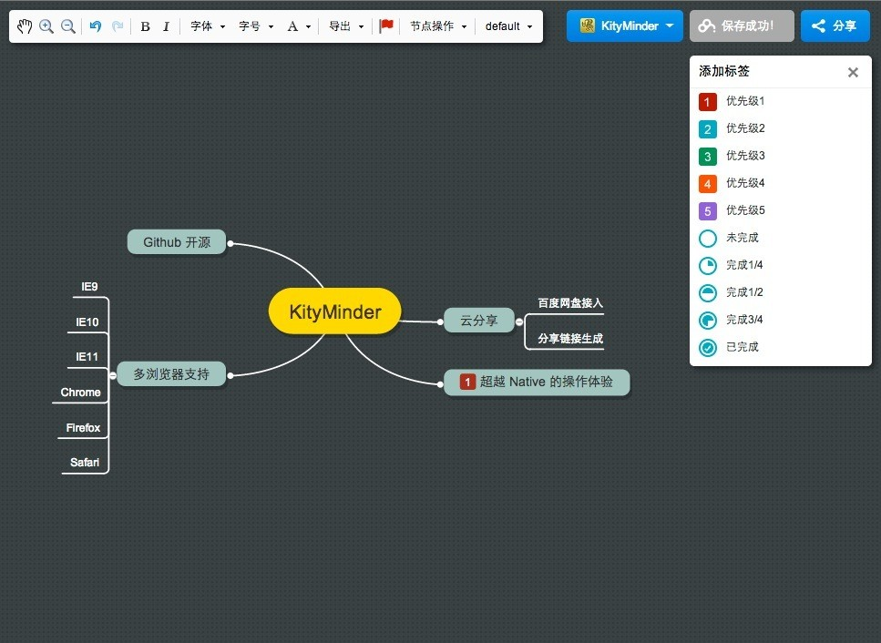

Kity Minder
==========

## 简介
KityMinder 是百度 FEX 团队的 f-cube 小组（原UEditor小组）的又一力作。作为一款在线的脑图编辑工具，它有着很多Native编辑工具的交互体验。KM与UE有着一样的宗旨，就是注重最终用户的使用体验。同时，它充分发挥了Web云存储的优势，可以直接将编辑中的脑图同步到云端。此外，借由独创的 “云盘分享”功能，用户可以一键将当前编辑的脑图直接生成在线链接共享给其他用户，实现无缝沟通。



KM是基于SVG技术实现，使用JavaScript+html实现。支持绝大多数的主流浏览器。
支持列表如下

1. Chrome
2. Firefox
3. Safari
4. IE9+

## 线上版本

产品地址：[http://naotu.baidu.com](http://naotu.baidu.com)

注意：由于历史原因，有三个发布过的公开地址：

1. [~~http://fex-team.baidu.com/kityminder/dist~~](http://fex-team.baidu.com/kityminder/dist)
2. [~~http://kitygraph.github.io/kityminder/dist~~](http://kitygraph.github.io/kityminder/dist)
3. [http://fex.baidu.com/kityminder/dist](http://fex.baidu.com/kityminder/dist)

第 1 个地址已经失效;

第 2 个地址不再维护更新（原因是我们项目地址迁移到了 fex-team）;

第 3 个地址是更新频率最高的地址，新功能可以在这里尝鲜;

[产品地址](http://naotu.baidu.com)已经稳定，请大家放心使用。地址变动频繁带来的不便，请谅解。

## 依赖说明

KityMinder 依赖 Kity 库。刚下载的压缩包或者刚从 github 拉下来的代码会有一个空的 kity 目录。要运行调试，必须加载 Kity 的依赖：

1. 如果你下载的是 KityMinder 的压缩包，那么需要手动下载 [Kity](http://kitygraph.github.io/kityminder/kity/dist/kitygraph.all.js) 库到 kity/dist/kitygraph.all.js

2. 如果你是从 github 上拉源代码下来的，那么可以更新一下子模块：

```bash
cd YOUR_KITYMINDER_PATH
git submodule init
git submodule update
```

## 联系我们
邮件: kity@baidu.com
讨论群: 374918234
