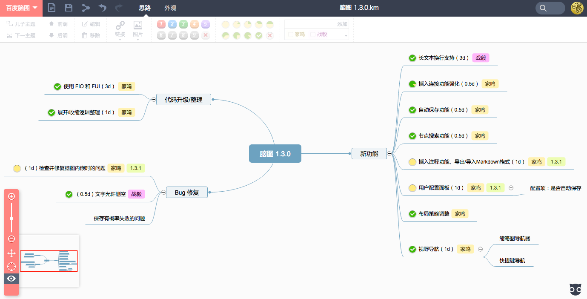

Kity Minder
==========

## 简介

KityMinder 是百度 FEX 团队的 f-cube 小组（原 UEditor 小组）的又一力作。作为一款在线的脑图编辑工具，它有着不亚于 native 脑图工具的交互体验。同时，它充分发挥了 Web 云存储的优势，可以直接将编辑中的脑图同步到云端。此外，借由独创的 “云盘分享”功能，用户可以一键将当前编辑的脑图直接生成在线链接共享给其他用户，实现无缝沟通。



KityMinder 基于 SVG 技术实现，支持绝大多数的主流浏览器，包括：

1. Chrome
2. Firefox
3. Safari
4. Internet Explorer 10 或以上

## 线上版本

产品地址：[http://naotu.baidu.com](http://naotu.baidu.com)

## 依赖说明

KityMinder 依赖 Kity、FIO、FUI 库。需要二次开发 KityMinder，需要先从 Github 上拉代码下来：

```bash
git clone https://github.com/fex-team/kityminder.git
```

紧接着，需要初始化并更新子模块：

```bash
git submodule init
git submodule update
```

## 联系我们

问题和建议反馈：[Github Issues](https://github.com/fex-team/kityminder/issues/new)
邮件组: kity@baidu.com
QQ 讨论群: 374918234
